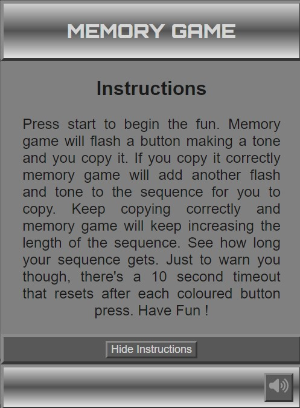

# **Memory Game**
The [‘Memory Game’](https://stephen-j-whitaker.github.io/memory-game/) is a game inspired by ‘Simon’, a memory game released in 1978 and is intended to be a fun and accessible way to test the short term memory skills of the player.

The Memory game plays a tone and ‘flashes’ one of the buttons and this should be copied by the player within a fixed period of time else the game will end. If the player successfully presses the same button, then another random button and corresponding tone is added to the sequence. If the player copies the whole sequence correctly then another button and tone is added and so on until the player copies the sequence incorrectly.

The game is what would be classed as a ‘retro’ game and it is designed to appeal to both new players who have not yet discovered the game and those who remember it from years gone by. For those that love the game ‘Memory Game’ will bring the game, that has traditionally been based on hardware implementations, into the realm of the world wide web where it can be enjoyed anywhere and anytime there is a connection to the internet. The interface is intuitive to new players and familiar to previous players and it’s hoped that it will give as much pleasure as the original, physical, game gave, and indeed still gives to so many today. 

The game is extremely easy to learn for those who are new to it and the combination of light and sound not only adds to the fun but also the games accessibility to those who are visually impaired. 

- [Link to live 'Memory Game' site](https://stephen-j-whitaker.github.io/memory-game/)

## **Contents**

1 [Project Initiation](#1-project-initiation)

2 [Game Development](#2-game-development)

3 [Features](#3-features)

4 [Testing](#4-testing)

5 [Project Sign Off](#5-project-sign-off)

6 [Releases](#6-releases)

7 [Deployment](#7-deployment)

8 [Technologies Use](#8-technologies-used)

9 [Credits](#9-credits)

## **1. Project Initiation**
- User stories
  
  User stories were ascertained for the game along with the features required to satisfy the user stories. A feature list was developed that covered all of the user stories requirements and it was ensured that there was no duplicated feature functionality going into development.

  - [User Stories](docs/pdfs/readme-user-stories.pdf)
  - [User stories acceptance criteria](docs/pdfs/readme-user-stories-acceptance-criteria.pdf)
  - [Feature list with acceptance criteria](docs/pdfs/readme-features-acceptance-criteria.pdf)

## **2. Game Development**
- ### **Game Functionality Development**

    - ### Interface Mockups
       Mockups for the game were developed that incorporated all of the features identified during project initiation. 

       The site design was developed to incorporate the features such that the use of the interface would be intuitive to a new user. All functionality is present within a single html page and is easy to find.
       
       -  [Mobile mockups](docs/pdfs/readme-mobile-mockups.pdf)
       -  [Tablet mockups](docs/pdfs/readme-tablet-mockups.pdf)
       -  [Desktop mockups](docs/pdfs/readme-desktop-mockups.pdf)
       -  [User interface flow](docs/pdfs/readme-user-interface-flow.pdf)

- ### **Game Style Development**
  - ### Typography
    A limited set of fonts was used for the site in an attempt to ensure that the site retained a coherent feel where none of the sections looked out of place contributing to the user's enjoyment of the site.
    
    - Logo
    
      A sans serif font Oribitron, sourced from [Google Fonts](https://fonts.google.com/) was selected for the game logo due to its retro game appearance. It is bold and easy to read drawing the user's attention to it and immediately identifying the site a memory game.

    - Site text

      The sans serif font Lato was selected for all other text on the site, again for the coherence of the site. It is easy to read at all sizes required for the site and on a wide range of devices. Lato was also source from [Google Fonts](https://fonts.google.com/).
    
    - 'Start' Button
      
      The SVG 'Start' button for the game uses the font 'Eras Bold ITC' sourced from within [Corel Draw](https://www.coreldraw.com/en/). The font is embedded as 'curves' in the SVG of the button to ensure it's always correctly positioned and scaled relative to the start button when the interface resizes in response to different screen sizes. It also removes the necessity to import the entire font into the site or create an additional external dependency. 

  - ### Colour Scheme

     The colour scheme for the site components was selected such that the button interface, consisting of a vibrant yellow, red, blue and green button would not clash with the other components of the site. Tones of grey are used for the site giving it a ‘clean’, modern and familiar appearance. 
     
     The header and footer have been given a linear gradient to give it the appearance of curved metal to give the site depth and the background for the main game interface is given a brushed metal appearance with linear gradient to complement the header and the footer. The metallic finish is intended to modernise the game slightly and add interest for the user. The site was designed with a mobile first approach and the game interface design helps ’transform’ the user phone appearance from their phone into ‘Memory Game’ helping to immerse them in the experience of playing it.

    The colour of the font was chosen such that should linear gradient fail and fall back to grey, the site would retain maximum accessibility with sufficient contrast between the text and the background colour. The linear gradients and text were arranged such that text on top of the linear gradient would always positioned where contrast between background and text would always ensure maximum accessibility.
      
  - ### Images / Interface

     All images used on the site are scalable vector graphics (SVG) to ensure that they remain sharp at all screen resolutions and sizes.
     
    - Favicon

      
      
      The favicon for the site is a copy of the button interface to help add to the identity of the site. An SVG version of the favicon is available for browsers that support it to ensure the best possible image on high resolution screens. A standard favicon.ico is the fallback for the SVG version. The SVG and ICO favicons both have transparent backgrounds to ensure the colour scheme of the browser shows through where the circular button interface image isn’t present.

    - Game pad

      The SVG for the button interface is embedded in the html to ensure that it is fully accessible and manipulatable as part of the DOM. The site requires that the SVG be manipulated with both CSS and JavaScript. Being part of interface it is also believed to be appropriate that it is embedded in the HTML in the correct location rather than referenced from elsewhere in the html in a separate ‘SVG’ specific area.
    
    - Mute/Unmute Button

      The icons for the mute/unmute button were taken from [Font Awesome]( https://fontawesome.com/). They are SVG files referenced using the HTML ‘img’ element. The images are a familiar metaphor that will easily be identified as a mute/unmute button by the user.

  - ### Layout

    - Header and Footer

      The site is laid out in a traditional way with a header and footer that will be familiar to the user despite the fact its styled to look like a physical interface. 

    - Instructions Dropdown
    
      The 'Instructions' dropdown is easy to find and is just below the header in a location that is commonly used for navigation elements. This should again be familiar to the user and help to make the site intuitive to use.

    - Game Interface
    
      The main section of the site is the game interface and related item, the current score (when visible during play) and the button to activate the top ten modal.

    - Mute/Unmute Button
    
      The footer holds the mute/unmute button as this is not a game feature as such, even though it mutes the game sound, it is considered an interface feature but not being a navigation item is believed to be more appropriately placed in the footer.

    - Top Ten and Name Entry Modals

      When visible, the top ten and name entry modals are positioned to intentionally obscure and prevent interaction with the game interface and Instructions drop down as using these at the same time as the modals is deemed unnecessary. The mute/unmute button can be visible and can be interacted with depending on the screen size. 
    
    - Responsiveness
    
      The layout is responsive and all elements resize in order to fit the screen on which they are displayed. The game is generally not compatible with landscape mobile devices with a small height and in these cases a modal requesting that the device be turned portrait is displayed.
  
  - ### User feedback

    In line with the design ethos of keeping the game retro in style buttons are styled to look like physical push buttons. The user knows that the button has been pressed either by the fact that a change in the interface takes place, such as a modal closes or the instructions dropdown opens, for example, or by a momentary change in the appearance of the button that was clicked. 

    In the case of the mute/unmute button and the Instructions Show/Hide buttons, the ‘outset’ border is momentarily replaced with a solid border to make it look like the button is fully pushed within a recess when clicked. The symbol on the mute button also changes to indicate a change in mute state as feedback that the request to mute or unmute has been successful. In the case of the instructions dropdown and in addition to the button style change, the button text toggles between Show Instructions and Hide Instructions, as appropriate, and the instructions drop down opens and closes.

    In the case of the coloured and start buttons, the top button SVG is momentarily hidden on click to reveal a smaller version underneath. This gives the button the appearance of being pressed in. The smaller momentarily revealed coloured buttons are also a brighter colour so they appear lit up when clicked and, if the game is unmuted, the click event triggers a tone which is a game feature but also acts as feedback to the user of a successfully administered ‘click’.

- ### **JavaScript Logic / Game Algorithm Development**

     An outline plan for the JavaScript code was produced containing some pseudo code. The code evolved during development but the structure remained largely the same as planned.

    - [JavaScript pseudo code](docs/pdfs/readme-javascript-pseudo-code.pdf)

## **3. Features**

  Features are combined and arranged within the game site in the way that was considered to be the most efficient and intuitive manner. Links to the feature list with acceptance criteria are provided. Multiple user stories are dependent on each of the features below and links to the dependent user stories and their respective acceptance criteria are provided.

  - ### **Landing Page** [[Feature](docs/pdfs/readme-features-acceptance-criteria.pdf) 'Game Landing Page' (ID 1)]

    - The 'Game Landing Page' (ID 1) [Feature](docs/pdfs/readme-features-acceptance-criteria.pdf) is a dependency of all the [user stories](docs/pdfs/readme-user-stories.pdf)
    - Implemented in [index.html](index.html)

    The game landing page (home page) is the users welcome to the site. It is designed to have the appearance of a physical, retro game and the bright colourful buttons are intended to be eye catching and stimulate the curiosity of the site visitor. 

    The styled buttons on the site are again intended to appeal to the visitor’s curiosity. Clicking the buttons and exploring the interactions with the site that are possible is part of the fun of using it. 
  
    The page is uncluttered and simple so as not to overwhelm the user and also to ensure that it is as intuitive to use as possible and quick to 'pick up and play' for returners to the site. The site has only one html page and so all functionality is provided by index.html meaning that navigation is simple and fast adding to the users enjoyment of the site. All interface features that are to be found on the landing page are detailed below.

    
    
    The landing page is responsive and rescales for the screen it is loaded onto. It was designed with a mobile first approach and gives the appearance of transforming the users mobile phone, into a retro, standalone memory game. On larger screens it fills the full height to the viewport but has a contstrained width.

      - **Header, Logo and Footer**

        The header’s function is to immediately inform the site visitor that the site is a memory game. The use of the header is to conform with current web practices and feel familiar to the user to help them feel at ease when interacting with the site.

        The header and footer have an outset border to make them appear 3D standing out from device. The background of the header and footer is a linear gradient to give the appearance of curved metal adding to the effect of appearing like a 3D physical retro game. Both the header and footer are responsive to fit onto different screen sizes and the logo slightly reduces in size on smaller screens.

        The logo is bold and eye catching and the Orbitron font from [Google Fonts](https://fonts.google.com/) was selected to give the site a retro game appearance. The font is off white which is aesthetically pleasing and is positioned within the linear gradient of the background such that there is always sufficient contrast between the background and the text for the necessary levels of accessibility.

        - **Header and Logo**

          

        - **Footer**
           
          The footer houses the mute/unmute button which is used to mute and unmute game tones during play.

          

    - **Turn device portrait modal**

      In a landscape orientation, the screen of small mobile devices may become too small to display all of the essential features of the game. In order to handle this event there is a media query that makes a ‘turn device portrait’ modal visible should the screen meet certain dimension criteria and be wider than it is tall (i.e. landscape). 

      

  - ### **Instructions Dropdown** [[Feature](docs/pdfs/readme-features-acceptance-criteria.pdf) 'Instructions' (ID 3)]

    -  The 'Instructions' (ID 3) [Feature](docs/pdfs/readme-features-acceptance-criteria.pdf) is a dependency of [user stories 1 and 3](docs/pdfs/readme-user-stories.pdf).
    - Implemented in [index.html](index.html)

    The instructions panel provides a concise, easy to read and follow set of instructions for new users of the game although it is quickly accessible should a returning player need a reminder of how to play.

    The instructions bar is the only nav section of the site. The button on the instructions dropdown bar uses to site wide common button style appearing like a push button that by momentarily replacing its outset border with a border appears to be pushed into a recess in response to an on click event. 
    
    Clicking the button, or touching it on a touch sensitive device, triggers a JavaScript class toggle triggers resulting in a transition that ‘slides’ the instruction panel open. The instruction panel, like the rest of the site, is responsive. Should the panel become too small to house the text on a particular screen, the text becomes scrollable and smaller on small screens. The instructions are part of the index.html page and as such opening and closing the panel does not trigger a page refresh. This design choice was made to add to the enjoyment and simplicity of using the site. It also adds to the site cohesion by keeping all functionality within one page adding to the effect of it appearing to be a physical device.

    - **Closed Instruction dropdown bar**

      

    - **Open Instructions dropdown bar**

      

  - ### **Top Ten** [[Feature](docs/pdfs/readme-features-acceptance-criteria.pdf) 'Top Ten Scores' (ID 4)]

    - The 'Top Ten Scores' (ID 4) [Feature](docs/pdfs/readme-features-acceptance-criteria.pdf) is a dependency of [user stories 1, 2 and 3](docs/pdfs/readme-user-stories.pdf).
    - Implemented in [index.html](index.html)

    The ‘Top Ten Scores’ feature is a way for the user to keep track of their progress and compare their successes with those of others who have played the game in the same browser. This adds to the fun of the game and also makes it more likely that the player will return to the game as they can compete and attempt to better their position in the table.

    The top ten button is prominently positioned, easy to recognise as a button, being styled like a physical push button and provides intuitive, quick access to the top ten table. The feedback to the user of a successful click of the button is the fact that the top ten modal opens.

    

    The top ten modal contains the top ten highest scores achieved within the browser. It is populated with data from the local storage of the browser on navigating to the game. If the local storage of the browser is cleared then the top ten table resets.

    The top ten modal is responsive and resizes as appropriate for the screen on which the game is being played. On all but the smallest screens sizes it was deemed most aesthetically pleasing to have the modal positioned and scale to leave the header and footer showing. On small screens where this is not possible the modal fills the screen.

    

  - ### **The Game** [[Data Feature](docs/pdfs/readme-features-acceptance-criteria.pdf) 'Game' (ID 5)]

    - The 'Game' (ID 5) [Feature](docs/pdfs/readme-features-acceptance-criteria.pdf) is a dependency of [user stories 1, 2 and 3](docs/pdfs/readme-user-stories.pdf).
    - SVG Buttons pad implemented inline in [index.html](index.html)
    - Game algorithm implemented in [game-script.js](assets/js/game-script.js)

    The game feature is the main function of the site. It provides the button pad and the algorithm required for the player to play the memory game.

    #### **SVG Game Button Pad**

    The button pad is a scalable vector graphic (SVG) produced in [Corel Draw](https://www.coreldraw.com/en/). The buttons are inspired by those of the ‘Simon’ game that originated in the 70s. There are four brightly coloured buttons that cover four slightly smaller version of the buttons that are a brighter tone of the same colour. In the centre of the button pad there is a start button that covers a slightly smaller version of the button. 

    - **Button pad before game starts**

       

    On occurrence of an on click event the top button that is clicked is hidden for a short period exposing the smaller version underneath creating the effect that is being pushed in and, in the case of the coloured buttons, lighting up due to the fact that the lower button is a brighter version of the same colour.

    There is a third circle in the middle of the SVG button pad that is made visible and ‘blanks’ the start button during game play to prevent start being re-pressed.

    For full access to the SVG in the document object model (DOM) with JavaScript and CSS, the SVG is embedded inline in the HTML. The SVG button pad was built in layers for easy identification, manipulation and styling of the various buttons when within the DOM.

    All of the SVG clickable buttons have a role attribute with the value ‘button’ and an aria label to describe them in the event that the site is being used with screen reading technology, maximising accessibility.

    The game pad is respinsive and rescales as necessary to fit the screen on which it is viewed. It will always retain the same shape and arrangement of the buttons as this is a key design feature of the game and helps the game retain its identity when viewed on devices of different sizes. 

    - **Game pad during play**

       

    #### **Game Algorithm**

    The game algorithm is entirely implemented in JavaScript. It manipulates the SVG in the DOM and reads ‘click’ events that take place on the game button pad in order to implement the game. 

    The game is simple and easy to learn for the uninitiated and fast to pick up and play for new players.

    A simplified description of the game algorithm is that the game starts by pushing a random button colour object into an array and then plays this ‘flash’ and tone to the player. After playing the first button ‘flash’ and tone, the game waits for the user to copy the flash tone and checks the colour of the button that the user clicks against the first and currently only array value. 

    If the player gets a sequence entry wrong or the user doesn’t press a coloured button within the 10 second timeout then the game ends and the score is checked against the top ten table. The timeout is present only when the game is waiting for the player to copy the sequence and it resets after each correct button click performed by the player.

    If the player successfully copies the first flash tone, the game pushes a new random button colour object into the array and then iterates through this array demonstrating the newly augmented sequence to the player before waiting for the user to copy it. When the player clicks a button the game checks the users button clicks against the array. The first click is checked against the first array value and if the button clicked was correct then the array counter (index) is incremented. After the next click the users button selection is checked against the array value at the new array index position and if this second click was correct then the array counter/index is incremented again and the game waits for input. This wait for input, check input against array, increment counter and wait cycle is repeated until the user doesn’t click within the timeout, clicks the wrong button or the end of the array is reached, in which case another button colour object is pushed into the game array and the game goes back to a waiting for player coloured button input state.  

    The algorithm has no maximum game array length set and so the game can continue indefinitely until the player gets the sequence wrong or doesn’t click a button within the 10 second timeout that is present when the game is waiting for the player to copy the sequence.

  - ### **Game Tones** [[Data Feature](docs/pdfs/readme-features-acceptance-criteria.pdf) 'Game tones' (ID 8)]

    - The 'Game tones' (ID 8) [Feature](docs/pdfs/readme-features-acceptance-criteria.pdf) is a dependency of [user stories 1, 2 and 3](docs/pdfs/readme-user-stories.pdf).
    - Web audio game tones are implemented in [game-script.js](assets/js/game-script.js)

    The optional web audio game tones feature serves two purposes. It adds to the fun for all players who choose not to mute the tones but it also enables more engaging game play for users who are visually impaired satisfying user story 3’s requirements.

    Each coloured button has a different sine wave frequency tone associated with it that both augments and provides an alternative to the colour of the button as a means of identifying the button that was flashed in the sequence or clicked by the user. The tone sounds momentarily on click of a coloured button and also when the game is demonstrating the sequences to be copied to the player.

    It was decided to use web audio tones that are generated within the browser, as opposed to playing an audio file, to minimise latency between the flash and the tone being produced which would negatively impact the players enjoyment of the game. Web audio is well supported by all major, modern browsers on mobile and desktop and so was considered a low risk approach to implementation of game sounds. 

    - **Game button tone frequencies:**

      | Button colour | Tone frequency|
      |---|---|
      | Yellow | 400 Hz |
      | Green | 500 Hz|
      | Blue | 600 Hz |
      | Red | 700 Hz |

  - ### **Mute/Unmute button** [[Feature](docs/pdfs/readme-features-acceptance-criteria.pdf) 'Mute/Unmute button' (ID 2)]

    - The 'Mute/Unmute button' (ID 2) [Feature](docs/pdfs/readme-features-acceptance-criteria.pdf) is a dependency of [user stories 1 and 2](docs/pdfs/readme-user-stories.pdf).
    - Mute/Unmute button is implemented in [index.html](index.html)
    - Mute/Unmute button functionailty is implemented in [game-script.js](assets/js/game-script.js)

    The mute/unmute button gives the player the option of whether or not to have game tones. 

    The game is muted on navigating to the site to avoid sound that isn’t wanted by the player if game sound effects are inappropriate for the environment they're in. 

    The mute/unmute button is easy to find and prominently placed in a common location for such a feature, the footer of the web page. It uses common metaphors to both identify it as a mute/unmute button and to communicate the mute state. 

    Implementation is by means of a gain node connected in between the oscillator node, that creates the sine wave game button tone, and the sound destination.  When muted the gain value is set to 0 and when unmuted, the gain node value is set to 0.1 to ensure the tones are an appropriate volume. 

    Clicking the mute/unmuted button triggers a function call that toggles between the mute and unmuted state and swaps the icon along with its ‘data-mute-status’ attribute accordingly. The getMuteStatus() function is responsible for checking the value of the ‘data-mute-status’ attribute in the icon image element of the icon that is currently showing on the mute/unmute button and then setting the gain value to as required. 

    - **When muted the button displays an icon of a speaker with a cross next to it**

      

    - **When unmuted the button displays an icon of a speaker with sound waves emanating from it**

      

  - ### **Current Score** [[Feature](docs/pdfs/readme-features-acceptance-criteria.pdf) 'Current score' (ID 6)]

    - The 'Current Score' (ID 6) [Feature](docs/pdfs/readme-features-acceptance-criteria.pdf) is a dependency of [user stories 1, 2 and 3](docs/pdfs/readme-user-stories.pdf).
    - Current Score display is implemented in [index.html](index.html)
    - Current score functionailty is implemented in [game-script.js](assets/js/game-script.js) 

    - **Current score display**

    

  - ### **Update Top Ten** [[Feature](docs/pdfs/readme-features-acceptance-criteria.pdf) 'Update Top Ten' (ID 7)]

    - The 'Update Top Ten' (ID 7) [Feature](docs/pdfs/readme-features-acceptance-criteria.pdf) is a dependency of [user stories 1, 2 and 3](docs/pdfs/readme-user-stories.pdf).
    - Update Top Ten functionailty is implemented in [game-script.js](assets/js/game-script.js)

## **4. Testing**
- ### **Code Validation**
- #### **HTML Validation**
- #### **CSS Validation**
- #### **JavaScript Validation**
- ### **Performance Tests**
- ### **Functionality Tests**

- Responsiveness

- ### **Bugs Found and Resolved or Current**

## **5. Project Sign Off**

## **6. Releases**

## **7. Deployment**

## **8. Technologies Used**

## **9. Credits**
- ### **Content**

Font Awsome
Google Fonts

- ### **Other Sources**

- ### **Acknowledgements**

Inspired by simon game
A special thank you to my mentor Maranatha Ilesanmi
Thank you to all those who were kind enough to test the website and provide feedback

## [Back To Top](#Contents)